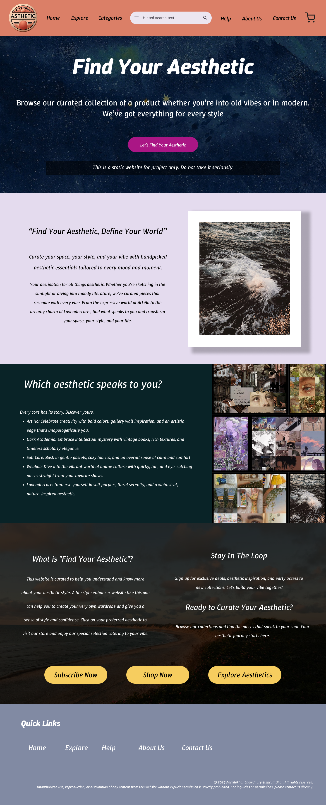
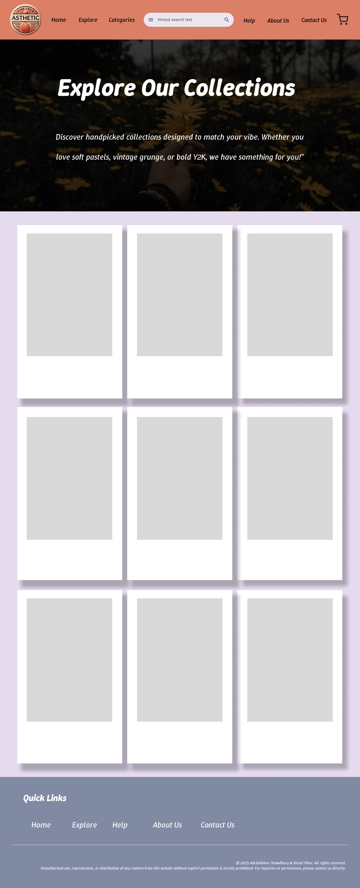

Here’s an updated and polished version of your `README.md` with improved structure, clearer descriptions, and consistent tone:

---

# 🌟 Find Your Aesthetic

Welcome to **Find Your Aesthetic** — a visually rich, interactive, and fully responsive website designed to guide users through the colorful world of aesthetic styles. Whether you're into vintage vibes, dreamy pastels, grunge tones, or minimalist design, this site helps you explore, learn, and connect with different aesthetic themes.

---

## 📌 Table of Contents

- [Overview](#overview)
- [Features](#features)
- [Project Structure](#project-structure)
- [Screenshots](#screenshots)
- [Tech Stack](#tech-stack)
- [Getting Started](#getting-started)
- [Deployment](#deployment)
- [Credits](#credits)
- [License](#license)
- [Support](#️support)

---

## 📖 Overview

**Find Your Aesthetic** is a static web project built using HTML, CSS, and JavaScript. The goal is to provide an elegant, immersive, and beginner-friendly experience for users to explore various aesthetics through engaging visuals and thoughtful layout.

Perfect for:
- 🎨 Creatives seeking design inspiration  
- 👩‍🎓 Students researching online aesthetic culture  
- 🧠 Anyone curious about visual subcultures and design trends

---

## ✨ Features

- ✅ **Responsive Navigation** – Dynamic hamburger menu for seamless mobile usability  
- 🌄 **Hero Banner** – Stunning intro section with a visual call-to-action  
- 📖 **About Us Section** – Tells the story behind the site  
- 🧭 **Explore Aesthetics Page** – Highlights different aesthetic categories  
- 🧰 **Interactive Cards** – Hover effects and transitions for engagement  
- 📱 **Mobile-Optimized** – Built with Flexbox and media queries for all devices  
- 🧼 **Clean & Modular Code** – Easy to read, maintain, and expand  

---

## 📁 Project Structure

```
Find-Your-Aesthetic/
│
├── index.html
├── explore.html
├── README.md
├── assets/
│   ├── css/
│   │   ├── style.css
│   │   ├── explorestyle.css
│   │   └── mobilestyle.css
│   ├── js/
│   │   └── script.js
│   ├── fonts/
│   │   ├── TiroDevanagariSanskrit-Regular.ttf
│   │   └── TiroDevanagariSanskrit-Italic.ttf
│   ├── images/
│   │   ├── pic1.jpg
│   │   ├── pic2.jpg
│   │   └── (more...)
│   └── screenshots/
│       ├── HomePage.png
│       ├── about-section.png
│       └── mobile-view.png
```

---

## 🖼️ Screenshots

### 🏠 Homepage


### ℹ️ Explore Page



---

## 🛠️ Tech Stack

Built using modern web technologies:

- **HTML5** – Semantic layout and accessibility
- **CSS3** – Custom styling, Flexbox layout, responsive design
- **JavaScript (Vanilla)** – Menu toggle and interactions
- **Google Fonts / Custom Fonts** – Adds character with Tiro Devanagari and WinkySans

---

## 🚀 Getting Started

To run the project locally:

1. **Clone the repository**
   ```bash
   git clone https://github.com/adrishikharchowdhury/Find-Your-Aesthetic.git
   cd Find-Your-Aesthetic
   ```

2. **Launch the site**
   - Open `index.html` in any browser  
   - Or use **Live Server** in VS Code for hot-reloading

---

## 🌐 Deployment

Live version hosted on GitHub Pages:  
🔗 [View Live Demo](https://adrishikharchowdhury.github.io/Find-Your-Aesthetic/)

### To deploy your own:
1. Fork or clone this repo  
2. Push to your own GitHub repository  
3. Go to **Settings > Pages**, select the `main` branch and `/ (root)`  
4. Save, and your site will be live shortly!

---

## 👥 Credits

Created by:

- **Adrishikhar Chowdhury** – [GitHub](https://github.com/adrishikharchowdhury)  
- **Shruti Dhar**

Thanks to:
- Open-source font creators
- Aesthetic design communities
- Everyone who gave feedback and suggestions

---

## 📄 License

Licensed under the [MIT License](LICENSE).  
Feel free to use, modify, and share this project for personal or commercial purposes.

---

## ❤️ Support

If you found this project helpful or inspiring, please consider:

- ⭐ Starring the repo  
- 📢 Sharing it with others  
- 💬 Providing feedback or opening issues

---

Let me know if you'd like this in markdown format for direct copy-paste, or want to add badges (like GitHub stars, license, or tech stack).